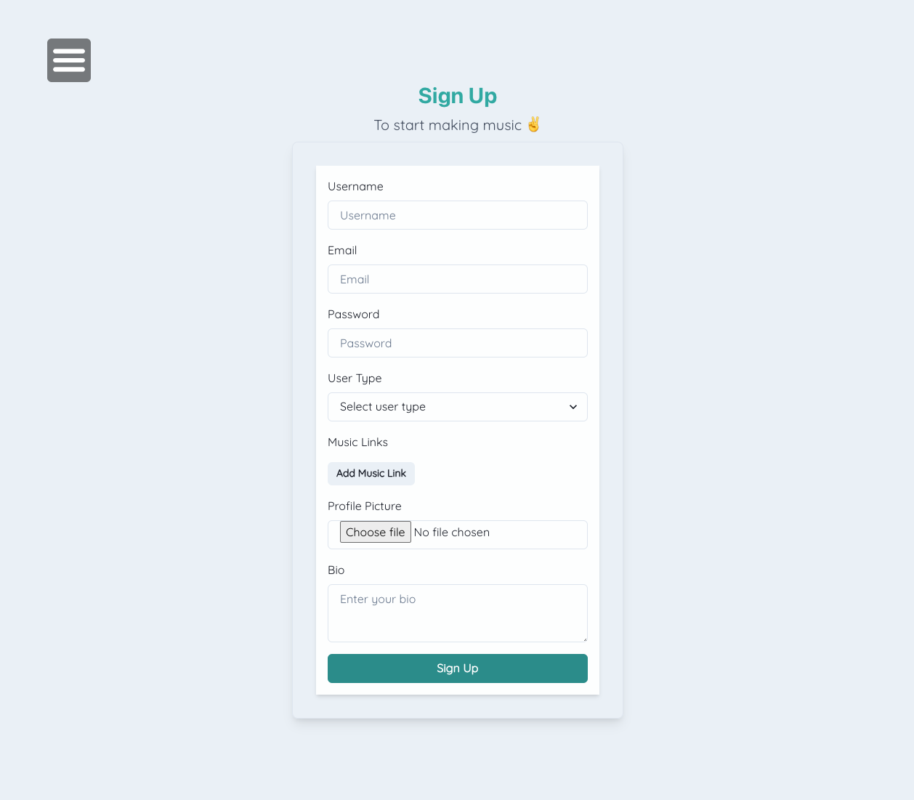

## Hey! Listen!


*An online marketplace forum where users can collaborate on music related projects together!*

[](https://developer.mozilla.org/en-US/docs/Web/JavaScript)  [](https://developer.mozilla.org/en-US/docs/Web/CSS) [](https://developer.mozilla.org/en-US/docs/Web/HTML)

---

## Packages used
[](https://react.dev/) [](https://nodejs.org/en/) [](https://mongoosejs.com/) [](https://expressjs.com/) [](https://graphql.org) [](https://redux.js.org/)

---

## Links
GitHub Repository: [@Hey-Listen](https://github.com/Sype7973/Hey-Listen/)

Link to deployed application: [Hey! Listen!](https://hey-listen-sound-caafe84374e5.herokuapp.com/)

---

## Contributors
> Adam Day [@GitHub](https://github.com/Sype7973)

> Elijah Brereton [@GitHub](https://github.com/elibrer)

---

## Table of Contents
- [Description](#description)
- [Installation](#installation)
- [Features](#features)
- [Documentation](#documentation)
- [Application Preview](#application-preview)
- [License](#license)
- [Tests](#tests)
- [Questions](#questions)

---

## Description

Hey! Listen! is a dynamic marketplace forum that brings together individuals from all corners of the music industry, providing a solution to an age-old problem: finding the perfect musical match to collaborate on projects with! Musicians and artists of all skill levels and experiences can join this vibrant community, where they can create and accept posts, work on commissions, and seek collaborations on their projects. Whether you're a producer in need of a talented vocalist, a songwriter looking for a skilled guitarist, or an artist seeking mixing and mastering expertise, Hey! Listen! is the platform for you. Our app empowers artists to connect with like-minded individuals and collectively bring their creative visions to life. From music production to instrumental arrangements, vocal features to mixing and mastering, Hey! Listen! offers a comprehensive range of options to transform musical dreams into reality. Embrace the power of collaboration and join Hey! Listen! today to unlock a world of endless possibilities in the music industry.

---

## Installation

For usage of this application, visit the [Hey! Listen!](https://hey-listen-sound-caafe84374e5.herokuapp.com/) website via heroku. No further installation is required to access and operate the web page. 

---

## Features
```md
- WHEN the user creates an account
- THEN the application creates a database entry with all their details, and encrypts sensative data, and logs them in
- WHEN the user logs in
- THEN they have access to creating Posts, accepting Commissions, and updating their Profile
- WHEN the user creates a Post on the Post dashboard, including details such as Post Title, Post Description, Post Type, Budget, and Deadline
- THEN the application saves the Post into the database, and displays the Post on the dashboard for all users to see
- WHEN the user accepts another users Post
- THEN the Post is converted into a Commission and is saved into the database
- WHEN the user views their Commissions on the 'My Profile' page
- THEN their Commissions are displayed, and sorted into 'Active' or 'Completed'
- WHEN the user clicks 'Complete Commission' on an 'Active' Commission, then the selected Commission is moved into the 'Completed' section of the page
- WHEN the user changes any settings in the My Profile Settings page
- THEN the database is updated with the new information, including the encryption of newly set passwords
- WHEN the user enters data into the Search Bar and 'Search' is clicked
- THEN the application will display a list of relevant search results, relating to the typed search string
- WHEN the user visits another users profile page
- THEN they are presented with relevant information of that user, and the ability to contact them via email
```

---

## Documentation

Presentation slides: 

[@Presentation]( **INSERT LINK HERE**)

Planning documents: 

[@Planning Notes](https://docs.google.com/presentation/d/1yiQUK79XQ6TlpR4LmUpJvDIuSPnb4Xywnj4sCPmsXHI/edit?usp=sharing)


---

## Application Preview
### `Hey! Listen! Home`

### `Hey! Listen! Dashboard`

### `Hey! Listen! My Profile`

### `Hey! Listen! Signup`


---

## License
[Licensed under the MIT license.](https://opensource.org/licenses/MIT)

---

## Tests
To test, simply run the application by using the instructions provided above. If there are any errors, or the application did not work in the intended way, please try to locate and log the lines of code that bring up the error, and forward all issues to the emails below.

---

## Questions
For questions and enquiries, please contact us at: 

[**INSERT ADAM EMAIL**](**AND HERE**)

[eli.brer@gmail.com](eli.brer@gmail.com)